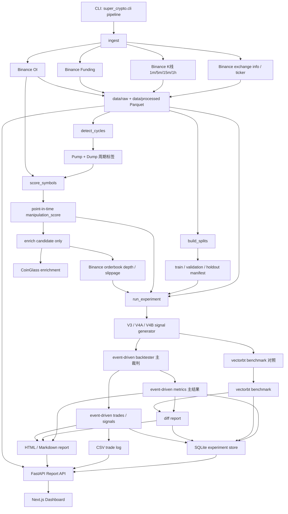

```mermaid
flowchart TD
    A[CLI: super_crypto.cli pipeline] --> B[ingest]

    B --> B1[Binance exchange info / ticker]
    B --> B2[Binance K线 1m/5m/15m/1h]
    B --> B3[Binance Funding]
    B --> B4[Binance OI]

    B1 --> C[data/raw + data/processed Parquet]
    B2 --> C
    B3 --> C
    B4 --> C

    C --> D[build_splits]
    D --> D1[train / validation / holdout manifest]

    C --> E[detect_cycles]
    E --> E1[Pump + Dump 周期标签]

    E1 --> F[score_symbols]
    B4 --> F
    F --> F1[point-in-time manipulation_score]

    F1 --> G[enrich candidate only]
    G --> G1[CoinGlass enrichment]
    G --> G2[Binance orderbook depth / slippage]

    C --> H[run_experiment]
    D1 --> H
    F1 --> H
    G2 --> H

    H --> I[V3 / V4A / V4B signal generator]
    I --> J[event-driven backtester 主裁判]
    I --> K[vectorbt benchmark 对照]

    J --> L1[event-driven metrics 主结果]
    J --> L4[event-driven trades / signals]
    K --> L2[vectorbt benchmark]
    L1 --> L3[diff report]
    L2 --> L3

    L1 --> M[SQLite experiment store]
    L2 --> M
    L3 --> M
    L4 --> M
    L4 --> N[CSV trade log]
    L1 --> O[HTML / Markdown report]
    L3 --> O
    L4 --> O

    M --> P[FastAPI Report API]
    N --> P
    O --> P
    C --> P
    P --> Q[Next.js Dashboard]
```
