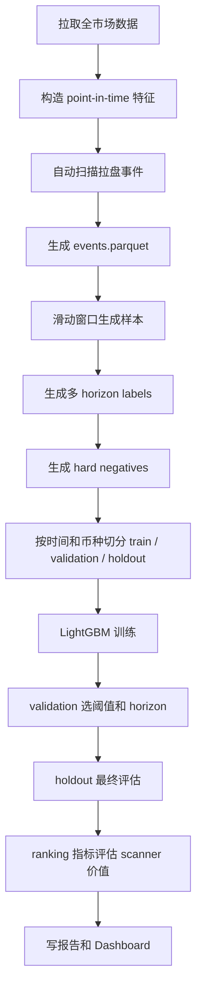

# Phase1 预测实验诊断与自动扫描改造方案

日期：2026-07-02

目标：修复当前 Phase1 预测实验中 `train F1=1`、`holdout F1=0` 的结构性问题，把“人工少量事件 + 单点正样本”改造成“全市场自动扫描事件 + 滑动窗口样本 + 多 horizon 训练”的可验证实验框架。

## 1. 当前结论

当前 Phase1 的失败不能简单归因于 LightGBM 不行。更准确的判断是：

- 样本太少。
- 正样本定义太窄。
- 负样本太容易。
- train / validation 没有严格分离。
- 缺失值处理会制造伪信号。
- 特征时间语义还不够严格。
- holdout 太小，不能可靠判断市场 regime 是否真的变化。

所以第一优先级不是换模型，而是重做样本生成和评估流程。

推荐主线：

```text
自动扫描全市场事件
  -> 生成事件表 event_start / peak_time / dump_end
  -> 用滑动窗口生成样本
  -> 训练多 horizon 二分类模型
  -> 用 ranking 指标评估实盘扫描价值
  -> 最后才看 holdout
```

## 2. 七个问题逐项诊断

### 2.1 样本太少，LightGBM 容易记住训练集

现状：

- 之前报告里只有 66 个样本。
- 正样本只有 11 个。
- holdout 只有 12 个样本。
- holdout 正样本只有 2 个。

这种规模对 LightGBM 太小。即使限制 `max_depth=3`、`num_leaves=7`，模型仍然可能记住训练样本里的偶然切分。

风险：

- train F1 接近 1 不代表有预测能力。
- holdout F1 为 0 也不一定能证明彻底无效，因为 holdout 正样本太少。

改法：

- 不再依赖人工逐个找事件。
- 自动扫描 Binance 合约全市场历史 K 线。
- 每根 15m K 都可以成为一个训练样本。
- 样本量目标至少达到：
  - 正样本：几百到几千。
  - 负样本：几万到几十万。
  - holdout 正样本：至少 50 个以上才有解释价值。

### 2.2 负样本太容易

现状：

- 当前负样本主要来自远离事件窗口的普通时间点。
- 逻辑上更像“拉盘附近 vs 安静期”。
- 这会让训练任务变得虚假简单。

真正困难的问题是：

```text
真拉盘前兆
vs
看起来很像前兆但最后没拉
```

必须加入 hard negatives：

- 高波动但没有继续拉盘。
- 成交量放大但没有突破。
- OI 异常但没有拉盘。
- Funding 异常但没有拉盘。
- 主动买入比例异常但没有拉盘。
- 同一时间其他币联动异动但没有成为主拉盘币。
- 拉盘结束后的残余高波动区间。

负样本类型需要在样本表里保留：

```text
negative_type:
  quiet
  high_vol_no_pump
  volume_spike_no_pump
  oi_anomaly_no_pump
  funding_anomaly_no_pump
  taker_anomaly_no_pump
  cross_section_decoy
  post_event_noise
```

### 2.3 正样本标签太窄

现状：

```text
positive_sample_time = event_start - 4h
```

每个事件只有一行正样本。

问题：

- 有些事件可能提前 30 分钟才有信号。
- 有些事件可能提前 2 小时开始蓄势。
- 有些事件可能提前 6 小时已有异动。
- 有些事件可能根本没有可预测前兆。

固定 4 小时会让标签噪声很大。

改法：

使用滑动窗口 forward-looking label：

```text
当前时间 t
如果 t 到 t+horizon 之间发生拉盘事件，则 label=1
否则 label=0
```

至少生成这些标签：

```text
label_pump_1h
label_pump_2h
label_pump_4h
label_pump_8h
label_pump_12h
```

这样可以回答核心问题：

```text
拉盘前信号到底提前多久出现？
```

### 2.4 train / validation 合并调阈值，导致阈值过拟合

现状：

- 当前代码把 `train`、`validation`、`train_validation` 合并成训练集。
- LightGBM 在这批数据上训练。
- 阈值也在同一批数据上选最佳 F1。

这是过拟合高发点。

正确流程：

```text
train:
  只训练模型参数

validation:
  选择阈值
  选择 horizon
  选择特征组
  选择 hard negative 策略
  选择模型超参

holdout:
  只跑最终评估
  不允许反复查看后继续调参
```

要求：

- LightGBM 不能在 validation 上 fit。
- threshold 不能在 train 上选。
- holdout 不能参与任何搜索。
- 每次 holdout 必须写 audit。

### 2.5 缺失值填 0 制造伪信号

现状：

- 阈值规则和 LightGBM 都把缺失值填成 `0.0`。
- Funding、OI、爆仓、盘口、链上等扩展数据缺失时，也容易变成 0。

问题：

```text
真实值为 0
和
数据缺失
```

被混在一起。

模型可能学到的是数据采集状态，而不是市场规律。

改法：

LightGBM 主线：

- 数值特征保留 `NaN`，让 LightGBM 自己处理缺失。
- 同时为关键数据源增加 missing flag。

示例：

```text
funding_rate
funding_missing
open_interest
open_interest_missing
liquidation_usd
liquidation_missing
orderbook_depth_usd
orderbook_missing
onchain_flow_usd
onchain_missing
```

阈值规则主线：

- 不能简单 `fillna(0)`。
- 每个规则必须声明缺失处理方式：

```yaml
missing_policy:
  funding_rate: skip_feature
  open_interest: skip_feature
  liquidation_usd: zero_is_valid_only_if_source_present
```

### 2.6 特征泄露风险

当前没有发现明确的硬未来函数，例如：

- `merge_asof(direction="backward")` 方向是正确的。
- Funding / OI 理论上取的是样本时间之前最近数据。

但仍有两个风险。

风险一：当前 K 线是否已收盘。

如果样本时间是 `10:00` 这根 15m K，当前特征包含这根 K 的 high/low/close/volume。实盘在 10:00 当下并不知道这根 K 的完整数据。

改法：

- 所有基于 K 线的特征默认 `shift(1)`。
- 样本时间 `t` 只能使用 `t` 之前已经收盘的 K 线。

要求：

```text
feature_end_time <= sample_time
```

风险二：15m 下特征窗口命名错误。

现状：

- `return_4h = pct_change(4)`。
- 但在 15m 周期里，4 根 K 只等于 1 小时。
- `return_24h = pct_change(24)` 实际只等于 6 小时。

改法：

所有窗口按 timeframe 自动换算：

```text
bars_per_hour = 60 / timeframe_minutes
return_4h = pct_change(4 * bars_per_hour)
return_24h = pct_change(24 * bars_per_hour)
rolling_24h = rolling(24 * bars_per_hour)
```

### 2.7 holdout 市场 regime 不同

这是可能原因，但当前不能优先归因到它。

原因：

- holdout 正样本太少。
- 样本生成方式有明显问题。
- 训练/验证流程有过拟合。
- 缺失值和特征时间语义还没修。

只有在修完上述问题后，如果仍然出现：

```text
train 稳定
validation 稳定
多个时间段 holdout 均失效
```

才能更严肃地判断：

```text
拉盘前兆预测本身不可迁移
```

## 3. 样本扩大方案：全市场自动扫描事件

### 3.1 不再人工逐个找事件

人工只适合做种子验证，不适合扩大训练集。

新的 Phase1 应该让系统自动扫描：

- 所有 Binance USDT-M 永续合约。
- 所有可用历史 15m K。
- 后续可扩展到 5m / 1h。

输入：

```text
OHLCV
Funding
OI
Taker buy/sell
Liquidation
Long-short ratio
Orderbook
Onchain
```

第一版必须有：

- OHLCV。
- Funding。
- OI。
- K 线里的 taker buy quote volume。

如果其他数据没有真实文件，必须在数据质量里显示缺失，不能伪装成 0。

### 3.2 自动事件定义

事件不是人工标注，而是从未来价格行为中自动定义。

建议第一版事件规则：

```yaml
event_detection:
  timeframe: 15m
  lookahead_hours: 8
  pump_return_min: 0.15
  min_quote_volume_usd: 500000
  min_range_pct: 0.08
  dedupe_gap_hours: 24
  peak_search_hours: 24
  dump_search_hours: 72
```

含义：

- 从任意时间点开始，未来 8 小时内最大涨幅超过 15%，认为可能发生拉盘事件。
- 成交额太低的币过滤掉，避免流动性太差导致假事件。
- 同一币 24 小时内只保留一个事件，避免重复计算。
- 找到事件后，继续定位：
  - `event_start`
  - `peak_time`
  - `dump_end`

### 3.3 事件表结构

新增事件表：

```text
data/processed/phase1/events.parquet
```

字段：

```text
event_id
symbol
timeframe
event_start
peak_time
dump_end
event_window_start
event_window_end
pump_return
max_return_1h
max_return_2h
max_return_4h
max_return_8h
pre_event_volume_zscore
quote_volume_usd
detection_rule
dedupe_group_id
split
label_quality
source
created_at
```

其中：

- `source = auto_scan`。
- `label_quality` 可以先用规则质量分：
  - `A`：涨幅、成交额、去重都满足。
  - `B`：涨幅满足但成交额一般。
  - `C`：边界样本，只做分析，不进训练。

## 4. 滑动窗口样本生成

### 4.1 样本粒度

默认每根 15m K 生成一行样本。

```text
sample_time = 当前 K 线收盘后可观察的时间
```

如果为了降低样本量，可以支持：

```yaml
sample_stride_bars: 1  # 每 15m 一条
sample_stride_bars: 4  # 每 1h 一条
```

第一版推荐：

```yaml
sample_stride_bars: 1
```

### 4.2 多 horizon 标签

对每个样本时间 `t`，生成多列标签：

```text
label_pump_1h
label_pump_2h
label_pump_4h
label_pump_8h
label_pump_12h
```

定义：

```text
如果 [t, t + horizon] 内存在 event_start，则 label_pump_horizon = 1
否则 label_pump_horizon = 0
```

同时保留辅助字段：

```text
next_event_id
next_event_start
time_to_event_minutes
future_max_return_1h
future_max_return_2h
future_max_return_4h
future_max_return_8h
```

### 4.3 标签排除区间

为了避免事件结束后的噪声污染负样本，需要加入 exclusion zone：

```yaml
labeling:
  pre_event_positive_hours: [1, 2, 4, 8, 12]
  post_event_exclude_hours: 24
  during_event_exclude: true
```

规则：

- 事件启动到 dump_end 之间不作为普通负样本。
- dump_end 后 24 小时内默认排除，避免拉盘后残留高波动污染。
- 对 ranking 评估可以保留，但要标记 `sample_zone=post_event`。

## 5. Hard Negative 设计

### 5.1 hard negative 来源

从所有 label=0 的样本中再分类型。

规则示例：

```yaml
hard_negatives:
  high_vol_no_pump:
    range_pct_min: 0.06
    future_pump_label: 0

  volume_spike_no_pump:
    volume_zscore_min: 3.0
    future_pump_label: 0

  oi_anomaly_no_pump:
    oi_change_abs_min: 0.08
    future_pump_label: 0

  funding_anomaly_no_pump:
    funding_abs_min: 0.001
    future_pump_label: 0

  taker_anomaly_no_pump:
    taker_buy_ratio_min: 0.70
    future_pump_label: 0

  cross_section_decoy:
    same_timestamp_other_symbol_event: true
    current_symbol_future_pump_label: 0
```

### 5.2 负样本配比

不能让 quiet negative 淹没所有样本。

建议第一版：

```yaml
sampling:
  positive_keep_ratio: 1.0
  negative_per_positive: 20
  hard_negative_ratio: 0.60
  quiet_negative_ratio: 0.40
```

含义：

- 每个正样本最多配 20 个负样本。
- 负样本里 60% 来自 hard negatives。
- 40% 来自普通安静期。

## 6. 训练方法取舍

### 6.1 保留 baseline：单点二分类

当前方法可以保留为 baseline：

```text
positive = event_start - 4h
negative = 远离事件普通时间点
```

但它不能再作为主结论来源。

用途：

- 验证和旧实验是否一致。
- 证明旧方法为什么容易 train 高、holdout 低。

### 6.2 主实验：滑动窗口二分类

这是 Phase1 主线。

每个 horizon 独立训练一个模型：

```text
lightgbm_binary_1h
lightgbm_binary_2h
lightgbm_binary_4h
lightgbm_binary_8h
lightgbm_binary_12h
```

每个模型预测：

```text
当前状态下，未来 N 小时内是否发生拉盘。
```

训练输入：

- 已 shift 的历史 K 线特征。
- Funding。
- OI。
- taker 主动买卖。
- 后续扩展 liquidation / long-short / orderbook / onchain。
- missing flags。

训练流程：

```text
train:
  fit model

validation:
  select threshold
  select feature set
  select horizon
  select hard negative strategy

holdout:
  final evaluation only
```

### 6.3 评估实验：ranking

Ranking 更贴近实盘扫描。

问题从：

```text
这个样本是不是会拉盘？
```

变成：

```text
当前全市场里，哪些币最值得盯？
```

第一版可以不单独训练 ranking model，而是用二分类模型输出概率后做横截面排序。

指标：

```text
Precision@3
Precision@5
Recall@5
Recall@10
Top-K hit rate
Mean Reciprocal Rank
NDCG@K
```

示例：

```text
每个 15m 时间截面，取预测概率最高的 Top 5 币。
看未来 4h 内真实拉盘事件是否出现在 Top 5。
```

这比普通 F1 更适合未来 scanner。

### 6.4 辅助实验：未来最大涨幅回归

回归目标：

```text
future_max_return_1h
future_max_return_2h
future_max_return_4h
future_max_return_8h
```

用途：

- 辅助判断模型是否能预测未来幅度。
- 给 ranking 增加排序参考。

风险：

- 容易学到已经启动后的动量。
- 不一定代表提前预测能力。

所以回归只做辅助，不作为 Phase1 主结论。

### 6.5 不建议主线使用异常检测

异常检测更适合：

- 已启动识别。
- 波动告警。
- 风控提示。

不适合作为“拉盘前兆预测”的主方法。

原因：

- 妖币拉盘前可能是平静期。
- 异常检测可能抓到的是已经拉起来之后，而不是启动前。

## 7. 数据与特征要求

### 7.1 第一版必需数据

```text
OHLCV:
  open/high/low/close/volume/quote_volume/trades

Taker:
  taker_buy_base_volume
  taker_buy_quote_volume

Funding:
  funding_rate

Open Interest:
  open_interest
  oi_value_usd
```

### 7.2 扩展数据

```text
Liquidation:
  long_liquidation_usd
  short_liquidation_usd

Long-short ratio:
  global_long_short_ratio
  top_trader_long_short_ratio

Orderbook:
  bid_depth_1pct
  ask_depth_1pct
  spread_bps

Onchain:
  cex_inflow
  whale_transfer
  project_wallet_transfer
```

扩展数据没有接入时，必须明确显示：

```text
source_status = missing
missing_ratio = 1.0
non_zero_count = 0
```

不能把缺失当成真实 0。

### 7.3 特征时间约束

所有特征必须满足：

```text
feature_end_time <= sample_time
```

默认规则：

- K 线特征 shift 1 bar。
- Funding / OI / liquidation 使用 backward asof。
- 横截面排名只使用当前时间已经可见的数据。
- 标准化、分位数、rank 不能用全样本未来数据。

## 8. Split 设计

### 8.1 时间 split

建议：

```yaml
time_split:
  train:
    start: "2025-01-01"
    end: "2025-12-31"
  validation:
    start: "2026-01-01"
    end: "2026-04-30"
  holdout:
    start: "2026-05-01"
    end: "2026-07-01"
  purge_gap_days: 5
```

### 8.2 symbol split

同时保留 symbol holdout：

```yaml
symbol_split:
  mode: fixed_manifest
  train_ratio: 0.70
  validation_ratio: 0.15
  holdout_ratio: 0.15
  seed: 42
```

### 8.3 最终三种评估

必须分别报告：

```text
time_holdout:
  已见币，未来时间

symbol_holdout:
  未见币，已见时间段

time_symbol_holdout:
  未见币，未来时间
```

最重要的是：

```text
time_symbol_holdout
```

## 9. 指标体系

### 9.1 分类指标

```text
Precision
Recall
F1
PR-AUC
ROC-AUC
False Positive Rate
Positive Rate
```

F1 解释：

```text
F1 = 2 * precision * recall / (precision + recall)
```

其中：

```text
precision = 预测为拉盘前兆的样本里，有多少真的拉了
recall = 真实拉盘前样本里，有多少被模型抓到了
```

### 9.2 Ranking 指标

```text
Precision@3
Precision@5
Recall@5
Recall@10
Top-K hit rate
Mean Reciprocal Rank
NDCG@K
```

这些指标优先级高于普通 F1，因为最终系统是 scanner。

### 9.3 交易前指标

Phase1 不直接证明能交易，但要输出交易前可用指标：

```text
alert_count_per_day
true_event_covered
false_alert_count
median_time_to_event
average_lead_time
top_symbol_concentration
liquidity_available_at_alert
```

如果模型每天报警几百次，即使 recall 高也没用。

## 10. Dashboard 要展示的内容

Phase1 页面必须新增以下模块：

### 10.1 自动事件扫描

展示：

```text
symbol
event_start
peak_time
dump_end
pump_return
detection_rule
split
label_quality
```

### 10.2 样本分布

展示：

```text
horizon
train samples
train positives
validation samples
validation positives
holdout samples
holdout positives
hard negative count
quiet negative count
```

### 10.3 模型结果

展示：

```text
model_name
horizon
feature_set
train_f1
validation_f1
holdout_f1
PR-AUC
threshold
overfit_flag
```

### 10.4 Ranking 结果

展示：

```text
horizon
Precision@3
Precision@5
Recall@5
Recall@10
Top-K hit rate
```

### 10.5 数据质量

展示：

```text
feature_group
source
missing_ratio
non_zero_count
available_symbols
available_time_range
```

## 11. 建议新增配置

新增：

```text
configs/phase1_scan.yaml
```

示例：

```yaml
phase1_scan:
  timeframe: 15m
  symbols_source: binance_usdt_perp
  min_quote_volume_usd: 500000

  event_detection:
    lookahead_hours: 8
    pump_return_min: 0.15
    min_range_pct: 0.08
    dedupe_gap_hours: 24
    peak_search_hours: 24
    dump_search_hours: 72

  feature_policy:
    shift_bars: 1
    timeframe_aware_windows: true
    preserve_nan_for_lightgbm: true
    add_missing_flags: true

  labeling:
    horizons_hours: [1, 2, 4, 8, 12]
    post_event_exclude_hours: 24
    during_event_exclude: true

  sampling:
    sample_stride_bars: 1
    positive_keep_ratio: 1.0
    negative_per_positive: 20
    hard_negative_ratio: 0.6
    quiet_negative_ratio: 0.4

  models:
    - lightgbm_binary
    - lightgbm_ranking_eval
    - lightgbm_regression_future_return

  splits:
    use_time_split: true
    use_symbol_split: true
    purge_gap_days: 5
```

## 12. 建议新增代码模块

```text
src/super_crypto/experiments/phase1_event_scanner.py
src/super_crypto/experiments/phase1_label_builder.py
src/super_crypto/experiments/phase1_hard_negatives.py
src/super_crypto/experiments/phase1_feature_builder.py
src/super_crypto/experiments/phase1_model_runner.py
src/super_crypto/experiments/phase1_ranking_metrics.py
```

职责：

```text
phase1_event_scanner:
  全市场自动扫描 event_start / peak_time / dump_end

phase1_label_builder:
  生成多 horizon forward-looking labels

phase1_hard_negatives:
  生成 hard negative 类型

phase1_feature_builder:
  生成 point-in-time 特征，处理 shift 和 missing flags

phase1_model_runner:
  训练 LightGBM，多 horizon 输出结果

phase1_ranking_metrics:
  计算 Top-K / Recall@K / NDCG
```

当前 `phase1_prediction.py` 可以逐步拆分，保留兼容入口。

## 13. 执行流程



## 14. 分阶段实施

### Phase1-A：修复当前实验可信度

必须先做：

- train / validation / holdout 三段分离。
- LightGBM 保留 NaN 或增加 missing flags。
- K 线特征 shift 1 bar。
- 15m 下修正 4h / 24h 窗口。
- 当前单点标签保留为 baseline。

验收：

- train F1 不再作为主结果。
- validation 和 holdout 单独显示。
- 报告明确标记过拟合。

### Phase1-B：自动事件扫描

新增：

- 全市场事件扫描。
- events.parquet。
- 自动去重。
- 事件质量分。

验收：

- 不需要人工逐个加 event window。
- Dashboard 能看到每个自动事件。

### Phase1-C：滑动窗口多 horizon

新增：

- 每根 15m K 生成样本。
- 1h / 2h / 4h / 8h / 12h 多标签。
- hard negatives。

验收：

- 样本量显著扩大。
- 每个 horizon 独立评估。
- holdout 正样本数量足够。

### Phase1-D：ranking scanner 评估

新增：

- 横截面 Top-K 评估。
- scanner 可用性指标。

验收：

- 不只看 F1。
- 能回答“每天报警多少次，Top 5 能抓到多少事件”。

## 15. 测试计划

### 15.1 单元测试

新增测试：

```text
test_phase1_timeframe_aware_windows
test_phase1_feature_shift_point_in_time
test_phase1_train_validation_holdout_separation
test_phase1_preserves_nan_or_missing_flags
test_phase1_auto_event_scan_dedupes_events
test_phase1_forward_labels_by_horizon
test_phase1_hard_negative_generation
test_phase1_ranking_metrics
```

### 15.2 数据质量测试

检查：

```text
每个 feature_group 的 missing_ratio
每个 horizon 的正负样本数量
每个 split 的 symbol 数量
holdout 是否被训练流程读取
feature_end_time 是否 <= sample_time
```

### 15.3 回归测试

运行：

```bash
uv run pytest tests/test_phase1_prediction.py
uv run pytest tests/test_report_api_phase1.py
uv run pytest
cd dashboard && npm run build
```

## 16. 最终判断标准

Phase1 不是为了证明“提前预测一定可行”，而是为了严格验证：

```text
妖币拉盘前兆是否存在可迁移信号？
```

只有满足以下条件，才算有研究价值：

- validation 不靠过拟合获得高分。
- holdout 有足够正样本。
- time holdout 和 symbol holdout 都不过度失效。
- ranking Top-K 指标有实盘扫描价值。
- false alerts 数量可控。
- 数据质量真实可审计。

如果改造后依然失败，结论反而更有价值：

```text
预测拉盘前兆不可迁移，应该放弃 Phase1 预测路线，回到文章后续的 V4A 回撤做空主线。
```
